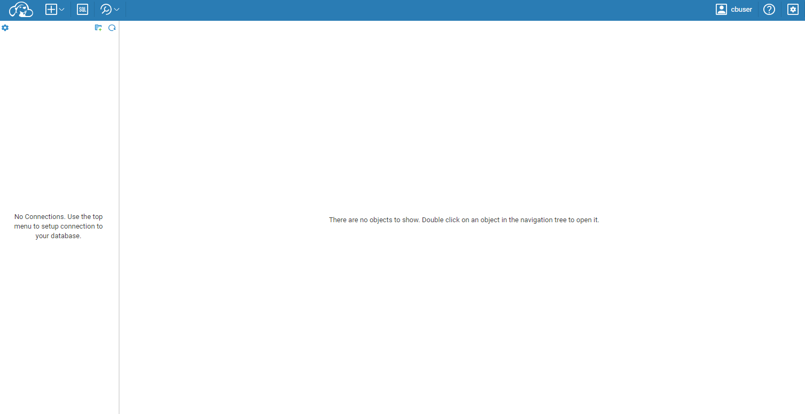

# openresty-cloudbeaver

# Quick Start

```bash
git clone https://github.com/v1tam1nb2/openresty-cloudbeaver-ce.git
cd openresty-cloudbeaver-ce
docker compose up -d
```

# Access

- [http://localhost:8888/](http://localhost:8888/)
  - User:`cbuser`
  - Password:`password`



# ClickHouse connection information

- User name
  - `testuser`
- User password
  - `password`
